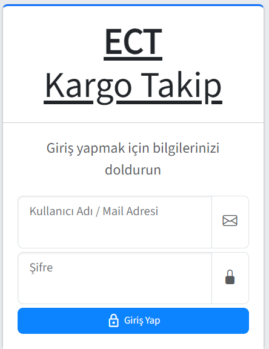
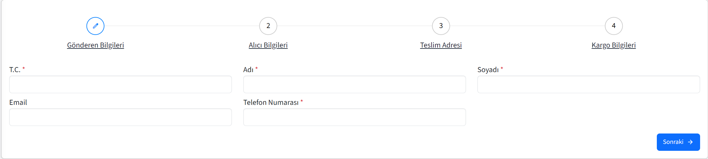
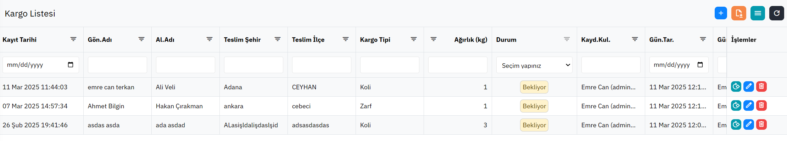
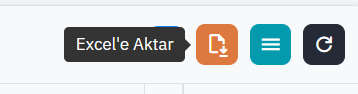

# Angular Kargo Takip Uygulaması

## 📌 Proje Tanıtımı

Bu proje, kargo takibini kolaylaştırmak için geliştirilmiş bir Angular uygulamasıdır. Kullanıcılar giriş yaptıktan sonra, admin panelinde kargo listelerini görüntüleyebilir ve çeşitli işlemler gerçekleştirebilir.

## 🚀 Özellikler

- **Kullanıcı Girişi:** JWT tabanlı kimlik doğrulama sistemi.
- **Admin Paneli:** Kullanıcı yönetimi ve kargo takibi için özel bir panel.
- **Kargo Listesi:** Güncellenebilir ve filtrelenebilir kargo bilgileri.
- **Excel Desteği:** Kargo listesini Excel olarak dışa aktarma.
- **Responsive Tasarım:** Mobil ve masaüstü uyumlu.

## 📷 Ekran Görüntüleri

### 🔑 Giriş Sayfası



### 🏠 Kargo Ekleme Paneli



### 📦 Kargo Listesi



### 📦 Excel Listesi Çekme



## 🛠️ Kurulum ve Çalıştırma

Projeyi çalıştırmak için aşağıdaki adımları takip edin:

```bash
# Bağımlılıkları yükleyin
yarn install  # veya npm install

# Uygulamayı çalıştırın
yarn start  # veya npm start
```

Uygulama varsayılan olarak `http://localhost:4200` adresinde çalışacaktır.

## 🔧 Kullanılan Teknolojiler

- **Frontend:** Angular 19, TypeScript
- **State Management:** RxJS
- **UI Kütüphanesi:** Bootstrap / Tailwind CSS
- **Backend:** .NET 9 Web API (OData, MediatR, FluentValidation, Mapster)
- **Mimari:** Clean Architecture, CQRS Pattern

## 📌 Geliştirici Notları

- Çıkış yapmak için admin panelinde sağ üst köşedeki **Çıkış Yap** butonunu kullanabilirsiniz.
- Kargo listesini Excel formatında indirmek için **Excel Butonu** kullanılabilir.

---

📧 İletişim ve geri bildirimleriniz için bana ulaşabilirsiniz!

